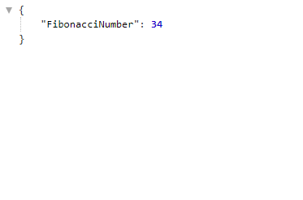

# ControlHub-Challenge

## This Project was made with Node, Express and Typescript

## This API gets a number and returns the index value of the Fibonacci Sequence

- On the src directory you will find the code to this challenge

- On the app file lays the configuration of Node and Express, ready to deploy

- On the routes directory you can find our challenge route and a controllers directory where we can find the logic to solve the challenge.

## Thought Process

- To solve this challenge i used the Node/Express and Typescript Template i regularly use to practice.
- When i read Fibonacci y remembered my JavaScript lessons and the exercises y did to recursively solve the sequence. 
- So i Googled the Fibonacci function and stored it on my controllers.
- Then i got the index by params in my route, used my controller and returned the Fibonacci number expected.

## To use this Repo
- You will only need to do an "npm install" on api directory
- Run "npm run dev" to Run the app locally
- http://localhost:3001/[Index] to see the results

## Working Solution

- Input Url on your browser with an index at the end of your choice
#

#
- See the Results
#

